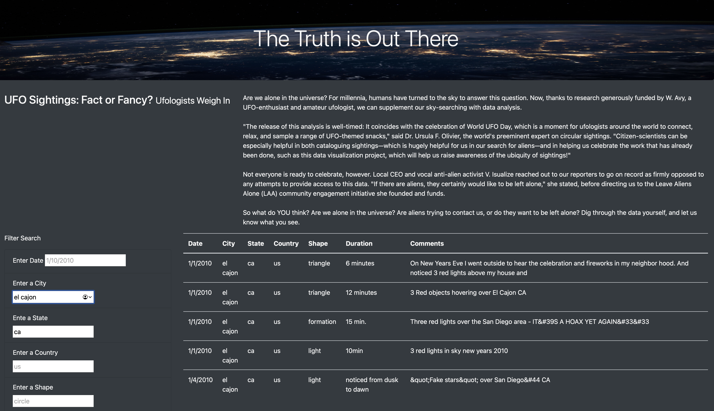

# Overview

Analyze UFO reports, using multiple criteria at the same time to filter records in the webpage. 

# Results

User can input any criteria to filter UFO records. the results will automatically refresh while user input in filter form.

# Summary

The drawbacks are:

* User have to type in criteria.
* Only one item can be type in each criteria.

I think that using select box or multi select box can get better experience.

